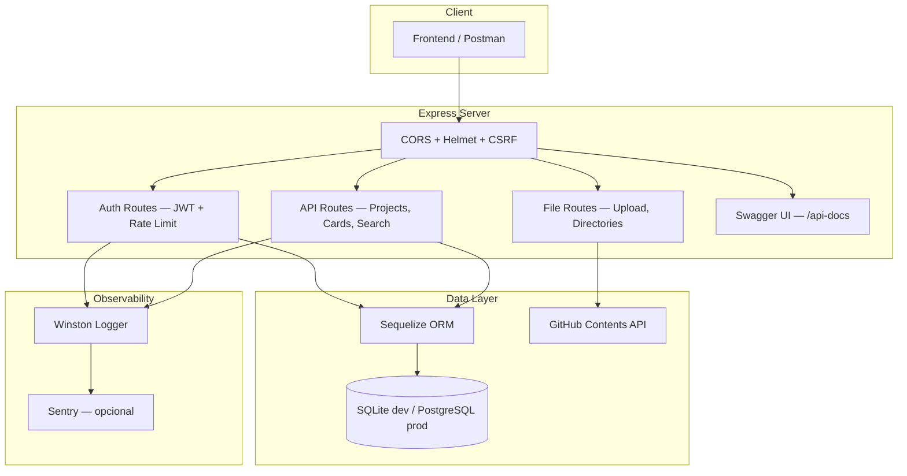

<div align="center">

# ES Database API

[](https://github.com/ESousa97/serverdatabase/actions/workflows/ci.yml)
[](https://github.com/ESousa97/serverdatabase/actions/workflows/security.yml)
[](https://www.codefactor.io/repository/github/esousa97/serverdatabase)
[](https://opensource.org/licenses/MIT)
[](#)

**REST API production-ready para gestão de projetos, cards, usuários e assets digitais — autenticação JWT com refresh tokens, proteção CSRF via csrf-csrf, upload de arquivos via GitHub API, documentação Swagger interativa e suporte a SQLite/PostgreSQL — Express 4, Sequelize 6, Vitest e Docker.**

</div>

---

> **⚠️ Projeto Arquivado**
> Este projeto não recebe mais atualizações ou correções. O código permanece disponível como referência e pode ser utilizado livremente sob a licença MIT. Fique à vontade para fazer fork caso deseje continuar o desenvolvimento.

---

## Índice

- [Sobre o Projeto](#sobre-o-projeto)
- [Funcionalidades](#funcionalidades)
- [Tecnologias](#tecnologias)
- [Arquitetura](#arquitetura)
- [Estrutura do Projeto](#estrutura-do-projeto)
- [Começando](#começando)
  - [Pré-requisitos](#pré-requisitos)
  - [Instalação](#instalação)
  - [Configuração](#configuração)
  - [Uso Local](#uso-local)
- [API Endpoints](#api-endpoints)
- [Scripts Disponíveis](#scripts-disponíveis)
- [Qualidade e Governança](#qualidade-e-governança)
- [Segurança](#segurança)
- [Docker](#docker)
- [FAQ](#faq)
- [Licença](#licença)
- [Contato](#contato)

---

## Sobre o Projeto

REST API server para gestão de projetos, cards, usuários e assets digitais. A aplicação utiliza JWT com refresh tokens para autenticação, proteção CSRF via double-submit cookie pattern (`csrf-csrf`), upload e gerenciamento de arquivos via GitHub API, e documentação interativa via Swagger em `/api-docs`. O banco de dados é flexível: SQLite para desenvolvimento e PostgreSQL para produção, ambos via Sequelize ORM.

O repositório prioriza:

- **Autenticação completa** — JWT com access token (15min) e refresh token (7 dias) em httpOnly cookie, rate limiting (10 req/15min) nos endpoints de auth
- **Proteção CSRF** — Double-submit cookie pattern via `csrf-csrf` com token endpoint dedicado e rotas isentas configuráveis
- **Gestão de arquivos** — Upload, renomeação, listagem e exclusão de arquivos/diretórios via GitHub Contents API com path traversal protection (`buildSafeRepoPath`)
- **Banco flexível** — SQLite em dev/test (memória para testes), PostgreSQL com SSL em produção, migrations e seeders via Sequelize CLI
- **Segurança em camadas** — Helmet, rate limiting, input validation (express-validator), ESLint security plugin, CodeQL e npm audit automatizados
- **Observabilidade** — Winston logger com file + console transports, Sentry integration opcional, health check em `/api/v1/ping`

---

## Funcionalidades

- **CRUD completo** — Projects (título, descrição, conteúdo, categoria) e Cards (título, descrição, imagem) com validação via express-validator
- **Autenticação JWT** — Login com bcrypt, access token de 15min, refresh token de 7 dias em httpOnly secure cookie
- **Proteção CSRF** — Token obtido via `GET /api/v1/csrf-token`, enviado no header `X-CSRF-Token` para mutações
- **Busca** — Endpoint `/api/v1/search` com LIKE/ILIKE adaptativo (SQLite/PostgreSQL) em título, descrição e conteúdo
- **Upload de imagens** — Multer (memória, 10MB max) com push para GitHub API, suporte a overwrite e detecção de conflito (409)
- **Gestão de diretórios** — Criar, listar, renomear e excluir diretórios/arquivos no repositório GitHub
- **Swagger docs** — Documentação OpenAPI 3.0 interativa em `/api-docs` com autenticação Bearer e CSRF
- **Error handling** — Classe `ApiError` com factory methods (400–500), handlers específicos para CORS, CSRF, Sequelize e validação
- **Docker ready** — Multi-stage build, non-root user, healthcheck integrado

---

## Tecnologias

### Core


### Segurança e Auth


### Ferramentas de Desenvolvimento


**Dependências principais:** express 4.21, sequelize 6.37, jsonwebtoken 9, csrf-csrf 3, multer 2, axios 1.13, winston 3, @sentry/node 8.

---

## Arquitetura



### Camadas Principais

| Camada             | Responsabilidade                                                                |
| ------------------ | ------------------------------------------------------------------------------- |
| **Middleware**      | CORS, Helmet, CSRF, auth JWT, validação (express-validator), error handling     |
| **Routes (api/)**  | Controllers para auth, projects, cards, categories, search, file management     |
| **Services**       | Lógica de negócio (authService com login/refresh)                               |
| **Models**         | Sequelize models (Project, Card, User) com migrations e seeders                 |
| **Utils**          | ApiError, github-client (path traversal safe), Winston logger                   |

---

## Estrutura do Projeto

```
serverdatabase/
├── api/
│   ├── auth/
│   │   ├── authController.js      # Login, refresh, logout
│   │   ├── authMiddleware.js       # Re-export do middleware JWT
│   │   └── authRoutes.js           # Rotas com rate limiting e validação
│   ├── index.js                    # Express app entry point
│   ├── cardlist.js                 # CRUD de cards
│   ├── project.js                  # CRUD de projetos
│   ├── categories.js               # Listagem de categorias
│   ├── search.js                   # Busca LIKE/ILIKE adaptativa
│   ├── imageupload.js              # Upload via Multer + GitHub API
│   ├── directorylist.js            # Listagem de diretórios
│   ├── directorycontent.js         # Conteúdo de diretório
│   ├── create-directory.js         # Criação de diretório (.gitkeep)
│   ├── deletecontent.js            # Exclusão de arquivos/diretórios
│   └── renamecontent.js            # Renomeação de arquivos
├── config/
│   └── config.js                   # SQLite (dev/test) / PostgreSQL (prod)
├── middleware/
│   ├── auth.js                     # authenticateToken + optionalAuth
│   ├── validate.js                 # Processamento express-validator
│   ├── error-handler.js            # Handlers globais de erro
│   └── index.js                    # Re-exports centralizados
├── models/
│   ├── index.js                    # Loader dinâmico de models (ES Modules)
│   ├── project.js                  # Model Project
│   ├── card.js                     # Model Card
│   └── user.js                     # Model User
├── services/
│   └── authService.js              # Login (bcrypt) + refresh token
├── utils/
│   ├── api-error.js                # ApiError com factory methods
│   ├── github-client.js            # Cliente GitHub API com path safety
│   └── logger.js                   # Winston (console + file)
├── migrations/                     # Sequelize migrations (projects, cards, users)
├── seeders/                        # Demo data (projeto + usuário admin)
├── tests/
│   ├── setup.js                    # Environment de teste (SQLite :memory:)
│   ├── api/
│   │   └── health.test.js          # Health check + CSRF token
│   ├── auth/
│   │   └── auth.test.js            # JWT + bcrypt
│   ├── unit/
│   │   ├── api-error.test.js       # ApiError class
│   │   ├── auth-middleware.test.js  # Auth middleware
│   │   └── validate-middleware.test.js  # Validate middleware
│   ├── utils/
│   │   └── logger.test.js          # Winston logger
│   └── integration/
│       └── health.test.js          # Placeholders (TODO)
├── .github/
│   ├── workflows/
│   │   ├── ci.yml                  # Lint → Test → Security → Build → Docker
│   │   └── security.yml            # CodeQL + Dependency Review + npm audit
│   ├── ISSUE_TEMPLATE/
│   ├── PULL_REQUEST_TEMPLATE.md
│   ├── CODEOWNERS
│   └── dependabot.yml
├── .husky/
│   ├── commit-msg                  # Conventional Commits validation
│   └── pre-commit                  # lint-staged
├── Dockerfile                      # Multi-stage, non-root, healthcheck
├── package.json                    # v1.1.0, type: module, Node >=20
├── vitest.config.js                # Vitest + v8 coverage
├── eslint.config.js                # Flat config + security plugin
├── .prettierrc                     # Semi, single quote, trailing comma
├── .editorconfig                   # UTF-8, LF, indent 2
├── .env.example                    # Template de variáveis de ambiente
├── CHANGELOG.md                    # Keep a Changelog format
├── CONTRIBUTING.md                 # Guia de contribuição
├── CODE_OF_CONDUCT.md              # Contributor Covenant 2.1
├── SECURITY.md                     # Política de segurança
└── LICENSE                         # MIT
```

---

## Começando

### Pré-requisitos

```bash
node --version  # v20 ou superior
npm --version   # v10 ou superior
```

### Instalação

1. **Clone o repositório**

```bash
git clone https://github.com/ESousa97/serverdatabase.git
cd serverdatabase
```

2. **Instale as dependências**

```bash
npm install
```

3. **Configure o ambiente**

```bash
cp .env.example .env
# Edite .env com suas configurações
```

4. **Execute as migrations**

```bash
npm run db:migrate
```

5. **(Opcional) Popule com dados demo**

```bash
npm run db:seed
```

### Configuração

Variáveis de ambiente essenciais (`.env`):

```env
# Server
NODE_ENV=development
PORT=8000

# Database (sqlite para dev, postgres para produção)
DB_DIALECT=sqlite

# Autenticação — gere secrets fortes para produção
JWT_SECRET=your-secure-secret
JWT_REFRESH_SECRET=your-refresh-secret

# CORS — origins separados por vírgula
CORS_ORIGINS=http://localhost:3000,http://localhost:5173

# GitHub Integration (opcional, para upload de arquivos)
GITHUB_REPO=username/repository
GITHUB_TOKEN=ghp_your_token
GITHUB_UPLOAD_PATH=public/assets
```

Consulte [`.env.example`](.env.example) para a lista completa de variáveis incluindo CSRF, Sentry e committer info.

### Uso Local

```bash
npm run dev
```

API disponível em: `http://localhost:8000`

Swagger docs em: `http://localhost:8000/api-docs`

---

## API Endpoints

| Método         | Endpoint                          | Descrição                 | Auth    |
| -------------- | --------------------------------- | ------------------------- | ------- |
| GET            | `/api/v1/ping`                    | Health check              | —       |
| GET            | `/api/v1/csrf-token`              | Obter token CSRF          | —       |
| GET            | `/api/v1/server-info`             | Info do servidor (dev)    | —       |
| POST           | `/api/v1/auth/login`              | Login (retorna JWT)       | —       |
| POST           | `/api/v1/auth/refresh`            | Renovar access token      | Cookie  |
| POST           | `/api/v1/auth/logout`             | Logout (limpa cookie)     | —       |
| GET/POST       | `/api/v1/projects`                | Listar/Criar projetos     | —/CSRF  |
| GET/PUT/DELETE  | `/api/v1/projects/:id`           | Operações em projeto      | CSRF    |
| GET/POST       | `/api/v1/cards`                   | Listar/Criar cards        | —/CSRF  |
| GET/PUT/DELETE  | `/api/v1/cards/:id`              | Operações em card         | CSRF    |
| GET            | `/api/v1/categories`              | Listar categorias         | —       |
| GET            | `/api/v1/search?query=`           | Busca em projetos         | —       |
| POST           | `/api/v1/imageupload`             | Upload de imagem          | CSRF    |
| GET            | `/api/v1/directories`             | Listar diretórios         | —       |
| GET            | `/api/v1/directory-content/:dir`  | Conteúdo de diretório     | —       |
| POST           | `/api/v1/create-directory`        | Criar diretório           | CSRF    |
| DELETE         | `/api/v1/delete-content`          | Excluir arquivo/diretório | CSRF    |
| PUT            | `/api/v1/rename-content`          | Renomear arquivo          | CSRF    |

Documentação completa interativa disponível em `/api-docs` com o servidor em execução.

---

## Scripts Disponíveis

```bash
# Servidor com file watching (--watch)
npm run dev

# Servidor de produção
npm start

# Testes unitários (Vitest)
npm test

# Testes com cobertura (v8)
npm run test:coverage

# Testes em modo watch
npm run test:watch

# Lint (ESLint + security plugin)
npm run lint

# Lint com correção automática
npm run lint:fix

# Formatação (Prettier)
npm run format

# Verificar formatação sem alterar
npm run format:check

# Migrations do banco
npm run db:migrate

# Seed de dados demo
npm run db:seed

# Reset completo (drop + create + migrate + seed)
npm run db:reset

# Auditoria de segurança
npm run security:audit
```

---

## Qualidade e Governança

O projeto adota práticas de governança para manter a qualidade do código:

- **CI** — Pipeline de 5 jobs: Lint → Test → Security Audit → Build & Validate → Docker Build via GitHub Actions
- **Security Scan** — CodeQL Analysis semanal, Dependency Review em PRs, npm audit automatizado com relatório
- **Testes** — Vitest com supertest para endpoints, mocks para middleware, cobertura v8 (api/, services/, utils/)
- **Linting** — ESLint 8 (flat config) com `eslint-plugin-security` + Prettier com check no CI
- **Git hooks** — Husky com lint-staged (pre-commit) e Conventional Commits validation (commit-msg)
- **Dependabot** — Atualizações semanais de npm (agrupadas por tipo) e mensais de GitHub Actions
- **Governança** — CODEOWNERS, issue/PR templates, CONTRIBUTING.md, CODE_OF_CONDUCT.md

> Para diretrizes de contribuição, consulte [`CONTRIBUTING.md`](CONTRIBUTING.md). Para política de segurança, consulte [`SECURITY.md`](SECURITY.md).

---

## Segurança

A aplicação implementa segurança em múltiplas camadas:

- **JWT** — Access token (15min) + refresh token (7 dias) em httpOnly secure cookie com SameSite=None
- **CSRF** — Double-submit cookie pattern via `csrf-csrf`, rotas de leitura e auth isentas
- **Rate limiting** — 10 requisições por 15 minutos nos endpoints de autenticação
- **Helmet** — Security headers (CSP, HSTS, X-Frame-Options, etc.)
- **Input validation** — express-validator em todas as rotas de mutação
- **SQL injection** — Queries parametrizadas via Sequelize ORM
- **Path traversal** — `buildSafeRepoPath` valida caminhos antes de interagir com GitHub API
- **ESLint security** — Plugin detecta regex unsafe, eval, timing attacks e buffer issues

Vulnerabilidades devem ser reportadas via [`SECURITY.md`](SECURITY.md) — não abra issues públicas.

---

## Docker

Build multi-stage com Node 25 Alpine, usuário non-root e healthcheck integrado:

```bash
# Build da imagem
docker build -t es-database-api .

# Executar com variáveis de ambiente
docker run -p 8000:8000 --env-file .env es-database-api
```

O healthcheck verifica `/api/v1/ping` a cada 30s com timeout de 3s.

---

## FAQ

<details>
<summary><strong>Como trocar de SQLite para PostgreSQL em produção?</strong></summary>

Altere `DB_DIALECT=postgres` no `.env` e configure `DB_HOST`, `DB_PORT`, `DB_NAME`, `DB_USER` e `DB_PASSWORD`. A configuração em `config/config.js` habilita SSL automaticamente em produção. Execute `npm run db:migrate` para criar as tabelas.
</details>

<details>
<summary><strong>Como funciona a integração com GitHub para upload?</strong></summary>

O endpoint `/api/v1/imageupload` recebe arquivos via Multer (memória, 10MB max), converte para base64 e faz push via GitHub Contents API. É necessário configurar `GITHUB_REPO`, `GITHUB_TOKEN` e `GITHUB_UPLOAD_PATH` no `.env`. Arquivos existentes retornam 409 a menos que `overwrite=true`.
</details>

<details>
<summary><strong>Como obter e usar o token CSRF?</strong></summary>

Faça `GET /api/v1/csrf-token` para obter o token. Envie-o no header `X-CSRF-Token` em todas as requisições POST/PUT/DELETE (exceto auth). Rotas de leitura (GET/HEAD/OPTIONS) são isentas automaticamente.
</details>

<details>
<summary><strong>O que o seed de dados cria?</strong></summary>

`npm run db:seed` cria um projeto demo (título "Projeto Demo", categoria "Teste") e um usuário admin (`admin@teste.com` / `123456`). Use `npm run db:reset` para recriar tudo do zero.
</details>

---

## Licença

Este projeto está sob a licença MIT. Veja o arquivo [LICENSE](LICENSE) para mais detalhes.

```
MIT License - você pode usar, copiar, modificar e distribuir este código.
```

---

## Contato

**José Enoque Costa de Sousa**

[](https://www.linkedin.com/in/enoque-sousa-bb89aa168/)
[](https://github.com/ESousa97)
[](https://enoquesousa.vercel.app)

---

<div align="center">

**[⬆ Voltar ao topo](#es-database-api)**

Feito com ❤️ por [José Enoque](https://github.com/ESousa97)

**Status do Projeto:** Archived — Sem novas atualizações

</div>
